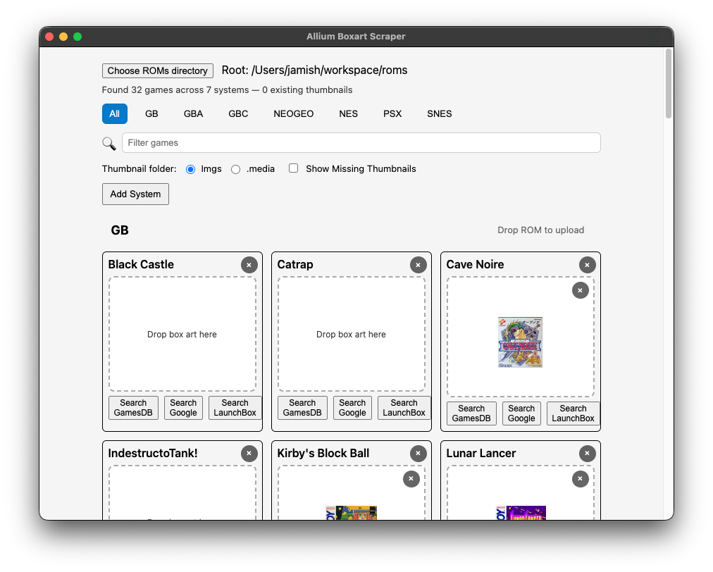

# Allium Boxart Scraper

*Disclaimer: This was vibe-coded!*

A desktop app for managing box art thumbnails for your ROM library targeting Allium OS. Point it at your ROMs directory and it scans for games across all configured systems, then lets you drag-and-drop box art images onto each game card. Images are saved as PNGs into the appropriate system thumbnail folder (`Imgs` or `.media`).

There's no actual "scraping" happening. Just some convenient browser links to search common sites for art, which you can drag-and-drop into the app and save to your SD card.



**Features:**
- Auto-discovers games from a ROMs directory, grouped by system (GB, GBA, GBC, NES, SNES, PSX, NEOGEO, etc.)
- `Add System` to add a new system directory to your ROMs directory.
- Drag a ROM onto the system name to upload the ROM, stripping out junk (`My Game(U).v2.gb` to `My Game.gb`)
- Drag box art images directly onto game cards to save thumbnails scaled to a 256px png.
- Filter by system, fuzzy-search by game name, or show only games missing thumbnails
- Quick-launch buttons to search GamesDB, Google, or LaunchBox for art. Firefox lets you drag the image directly into the app without a manual download.
- Can override the Thumbnail Folder to `.media` for NextUI; `Add System` not tested on NextUI.

Built with Electron, React, and TypeScript.

## Quick Start

```bash
npm install
npm start
```

## Exporting

```bash
npx electron-packager . AlliumScraper \
  --platform=darwin \
  --arch=arm64 \
  --out=release \
  --overwrite \
  --app-bundle-id=sh.jami.allium_scraper \
  --prune=true
```
